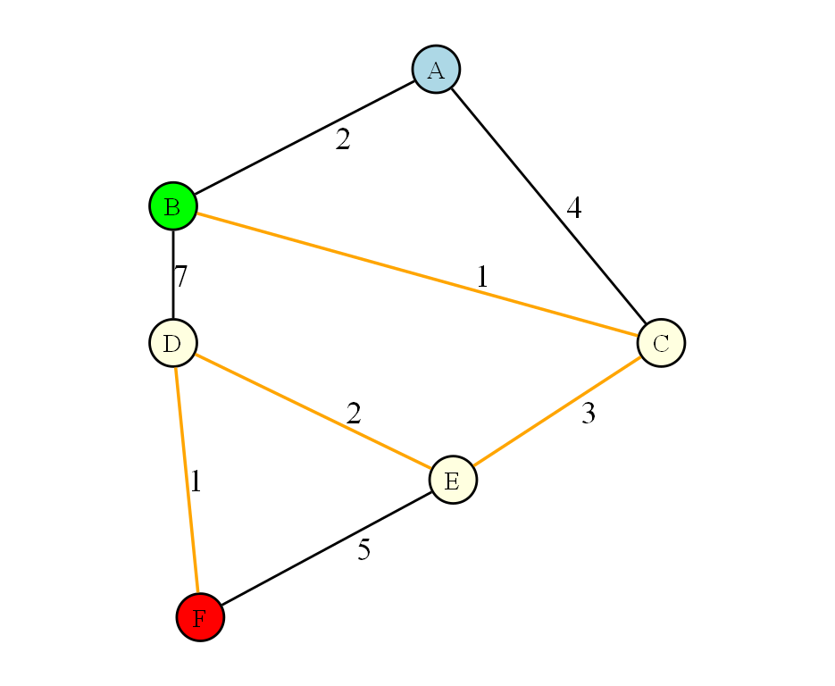

# 🚗 Path Finder - Shortest Path Navigator

A C++ application that simulates a basic map navigation system by allowing users to create a weighted graph representing connected locations. Using **Dijkstra's Algorithm**, it computes the **shortest path** and **minimum travel distance** between any two locations while also generating a visual representation of the map using **Graphviz**.

---

## ✨ Features

- 📍 Create a custom map by entering connected locations and distances.
- 🛣️ Find the **shortest route** between any two locations.
- 📏 Calculate the **minimum total distance**.
- 📊 Display the complete graph as a **PNG** or **SVG** image using Graphviz.
- 🖥️ Interactive command-line interface.

---

## 📖 How It Works

1. Enter the connections between locations in the format:

   ```
   Source Destination Distance
   ```

   Example:

   ```
   0 1 2
   0 2 4
   1 2 1
   1 3 7
   2 4 3
   3 5 1
   4 3 2
   4 5 5
   -1
   ```

2. Enter the starting and destination locations.

3. The program:

   - Builds a weighted graph.
   - Runs **Dijkstra's Algorithm**.
   - Finds the shortest path.
   - Calculates the minimum distance.
   - Generates a visual representation of the graph using Graphviz.

---

## 📷 Example

- Colour Scheme
   - Default Nodes(places) - Light Blue
   - Default Edges(roads) - Black
   - Start/Source - Green
   - Destination - Red
   - Path - Light Yellow



### Input

```
Start: 0
End: 5
```

### Output

```
Shortest Path:
0 -> 1 -> 2 -> 4 -> 3 -> 5

Total Distance:
9
```

The generated graph image (`graph.png` or `graph.svg`) visually represents the map and its connections.

---

## 🛠️ Technologies Used

- C++
- Graph Theory
- Dijkstra's Algorithm
- STL
  - vector
  - priority_queue
  - pair
- Graphviz

---

## 📂 Project Structure

```
Shortest-Path-Navigator/
│
├── main.cpp
├── main.exe
├── graph.dot
├── graph.svg
└── README.md
```

---

## ⚙️ Algorithm

This project uses **Dijkstra's Algorithm**, a greedy shortest-path algorithm that computes the minimum distance from a source node to every other node in a graph with **non-negative edge weights**.

### Time Complexity

| Operation | Complexity |
|-----------|------------|
| Building Graph | O(E) |
| Dijkstra's Algorithm | O((V + E) log V) |

where:

- **V** = Number of vertices
- **E** = Number of edges

---

## 🎯 Applications

This project demonstrates the core concept used in navigation systems such as:

- 🗺️ Google Maps
- 🚗 GPS Route Planning
- 🚚 Logistics & Delivery Networks
- 🚇 Transportation Networks
- 🌐 Network Routing

---

## 🚀 Future Improvements

- Highlight the shortest path in the generated graph.
- Allow named locations instead of alpha-numeric nodes.
- Read graph data from a file.
- Interactive GUI for map creation.
- A* Search Algorithm for faster pathfinding.
- Real-world map integration.

---

## 📸 Graph Visualization

Graphviz is used to convert the generated `.dot` file into a visual graph.

```
graph.dot
      │
      ▼
Graphviz (dot)
      │
      ▼
graph.png / graph.svg
```

---

## 🤝 Contributing

Contributions, feature suggestions, and improvements are welcome!

If you find a bug or have an idea for enhancement, feel free to open an issue or submit a pull request.

---

## 📜 License

This project is open source and available under the **MIT License**.